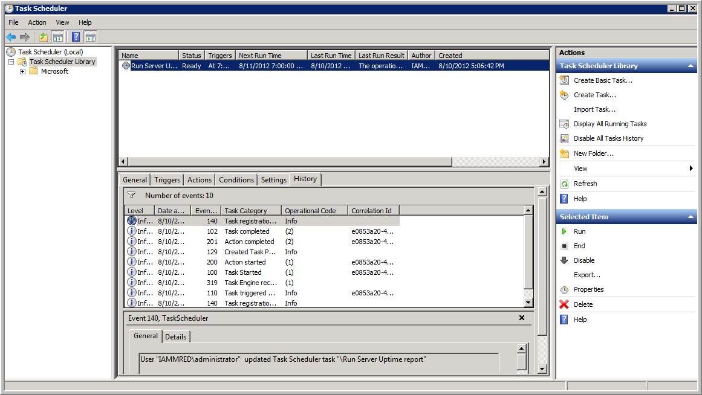

# cyberhw4
## Matthew Moltzau, Ryan Vacca, Julia Vrooman
### Part 1 Report

For this part of the project, the first thing that we collectively learned was that there are many, many ways for an object to be added to a location within the registry where it could be executed upon startup. Of course, these locations would be important to monitor, but because they are so dispersed across the registry, that becomes more difficult. 

We decided to focus on the current user and local machine shell folders and user shell folders for this purpose to catch as many as reasonable, although a malicious actor could likely find a way to bypass this effort. The base of this program surrounds examining the startup directories referenced by the aforementioned registry directories. 

The program begins by reading a file of known startup applications using a hashset. These are then compared to applications which have been added to the startup file which weren't captured as existing startup applications. Because these new applications have now been added to the startup location within the registry, the program then adds them to the list of known startup applications so that they won't be re-recorded upon future starts. Adding these to the file of recognized programs will prevent the user from being notified of their addition at every five-minute interval. Though this could pose as a security risk by leaving it in the hands of the user to respond to the threat after one notification, the other option of having a notification about these files, which might be legitimate, would be a nuisance. 

The attached logs, displayed below, show the functionality of the program for part 1. It collects the known objects set to run on startup, and then shows updates the user as to what programs have been added to the specified locations. 

Running the file by itself will generate a report for any unknown files and does not include any timing directly. In order to run the program every five minutes, we used the Windows Task Scheduler. Here is a screenshot of the Windows Task Scheduler:

